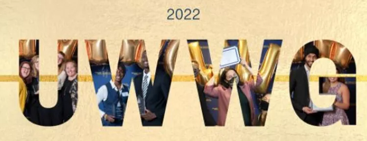

<!--  -->

<!--  -->



<!--  -->

<!--  -->

<!--  -->

**News** 

**5/2022** Technology Transfer Consulting Club is being honored as the winner of "Danielle McDonald Legacy Award 2022" presented by Student Government Association at Georgia Tech

