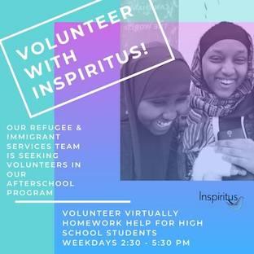
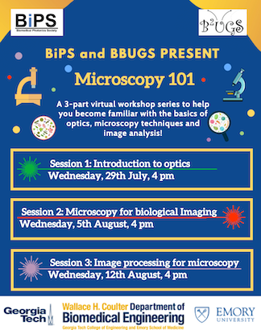

<!--  -->

<!--  -->



<!--  -->

<!--  -->

<!--  -->

**3/31/2021** BiPS received “Emerging Excellence Award” - Up with the White & Gold 2021 by the Center for Student Engagement and the Student Government Association

.png)

.png)

**3/12/2021**  BiPS members met for a picnic in Piedmont park. 

**2/10/2021** BiPS held an all member meeting on Feb 10th 2021. 

**1/1/2021** Happy new year everyone! Here’s to a good 2021 

**11/20/2020** We discussed 12 publications at the weekly [Biophotonics journal club](https://bipsgatech.github.io/journal-club) during Fall 2020! 

**10/27/2020** BiPS had an all member meeting to celebrate past initiatives and gather ideas for the next activities. Thank you all for attending and sharing invaluable ideas!! 

**10/07/2020** BiPS hosted a ‘5-Minute Research Presentation’ event for members to share their research and create a student network across Georgia Tech and Emory.

**9/15/2020** BiPS now has more than 50 members! [Come join our Microsoft Teams](https://teams.microsoft.com/dl/launcher/launcher.html?url=%2F_%23%2Fl%2Fteam%2F19%3A946d63e6748d4168a009cd653a12bdc8%40thread.tacv2%2Fconversations%3FgroupId%3De3cb8047-564c-44df-a290-b786c843ee71%26tenantId%3D482198bb-ae7b-4b25-8b7a-6d7f32faa083&type=team&deeplinkId=6f42a7be-5ed6-4db3-aa3f-91140f3c5635&directDl=true&msLaunch=true&enableMobilePage=true&suppressPrompt=true)! 

**8/31/2020** BiPS has initiated an outreach bridge with Inspiritus to connect virtual tutors needed for refugee & immigrant high school students. If you are interested, sign up [here](https://docs.google.com/forms/d/e/1FAIpQLScfJl9P4Arbc9it4OtHKM4U7lvp2vJGv3Qh6SJpYUNc_i_ibA/viewform)! Contact Paloma with any questions.

**8/14/2020** We discussed 21 publications at the weekly [Biophotonics journal club](https://bipsgatech.github.io/journal-club) during Summer 2020!  

**8/12/2020** Microscopy 101 Virtual Sessions were a success, with more than 70 attendants over all workshops! Thank you everyone for attending. 

**8/12/2020** Session 3 of Microscopy 101 - "Image Processing for Microscopy". Watch the recording [here](https://www.youtube.com/watch?v=EOSELo_BMqQ)!

**8/4/2020** Session 2 of Microscopy 101 - "Microscopy for Biological Imaging". Watch the recording [here](https://youtu.be/aWmRhphZeyk)!

**7/29/2020** Session 1 of Microscopy 101 - "Introduction to Optics". Watch the recording [here](https://youtu.be/X7hKF_OKwKw)!

**6/17/2020** Microscopy 101 Virtual Sessions announced!  
  

**6/3/2020** The BiPS [Microsoft Teams](https://teams.microsoft.com/dl/launcher/launcher.html?url=%2f_%23%2fl%2fteam%2f19%3a946d63e6748d4168a009cd653a12bdc8%40thread.tacv2%2fconversations%3fgroupId%3de3cb8047-564c-44df-a290-b786c843ee71%26tenantId%3d482198bb-ae7b-4b25-8b7a-6d7f32faa083&type=team&deeplinkId=b0e75d35-373e-4904-98bc-90e42ff390ee&directDl=true&msLaunch=true&enableMobilePage=true&suppressPrompt=true) group now has more than 40 members! Come join us!

**6/3/2020** Patrick Ledwig wins the first BiPS trivia night! Congrats Patrick! 

**5/20/2020** Distributed [survey](https://docs.google.com/forms/d/e/1FAIpQLSfTlYQRCFOhuHpfr9MdH-v1RMtRI5e2gdpm3mkezbyeksj_2Q/viewform) for co-hosting a workshop event with BBUGS.

**5/18/2020** We’ve been approved as an official OSA student chapter! 

**3/13/2020** We’re listed as an [official BME Graduate Organization](https://bme.gatech.edu/bme/get-involved)

**3/06/2020** Our NEW student organization has been officially chartered by Georgia Tech!
